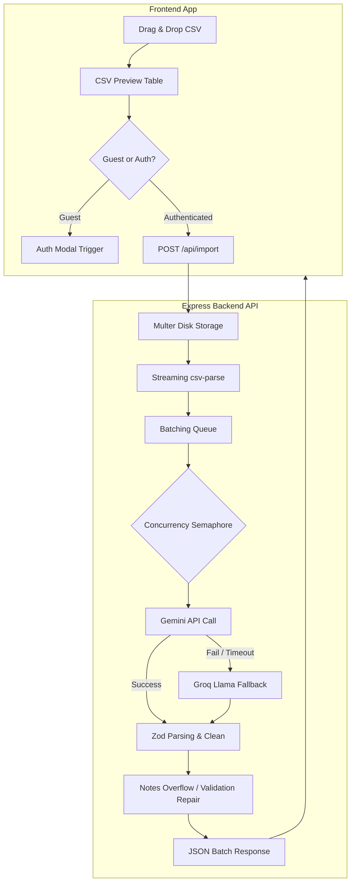

# GrowEasy - AI CRM Importer

GrowEasy is a full-stack, production-ready AI-powered CSV Importer designed to eliminate manual spreadsheet mapping for sales and marketing teams. By utilizing LLM-based column schema mapping and validation, GrowEasy standardizes unstructured contact lists of any shape and size into clean, deduplicated, and validated CRM lead objects in real-time.

---

## Screenshots

### 1. Landing Page


### 2. CRM Import Results Dashboard


### 3. Recent Upload History (with verified record counts)


### 4. Live Processing State


---

## Features

### Frontend
- **State-Based Tab Routing:** Seamlessly switches between the **Home** (marketing landing) and **Upload Files** (importer workspace) views.
- **Unified Scroll Navigation:** Sticky header navbar links (Features, Solution, About Us) automatically switch tabs and perform smooth anchor scroll jumps.
- **Interactive Visual Analytics:** Renders distribution charts for CRM Lead Status (pie chart) and Lead Source distribution (bar chart) using responsive Recharts layouts.
- **Guest Preview Mode:** Allows unregistered visitors to upload and preview CSV columns locally. Sign-in intercepts trigger only when starting the server sync.

### Backend & Resilience
- **Zero-RAM Streaming:** Processes uploads using streaming file reads (`fs.createReadStream`) combined with Multer disk staging to handle massive CSV inputs without memory bloat.
- **Global Concurrency Limits:** Semaphore-based rate controls (`p-limit`) protect the LLM gateway from rate exhaustion when processing simultaneous uploads.
- **Hot-Swap LLM Provider Failover:** Primary operations run on **Google Gemini 2.5/3.1** models. If a rate limit (HTTP 429) or API timeout is hit, the system automatically routes remainder batches to **Groq Llama** models mid-run.
- **Zod Data Repair:** Automated field repairs (e.g., standardizing phone digits, cleaning malformed email casing) salvage partially corrupted LLM outputs.

---

## Architecture

The diagram below details the data ingestion, validation, and AI transformation pipeline:



---

## Tech Stack

- **Frontend:** Next.js (App Router), React 19, Tailwind CSS, Framer Motion, Recharts, Vitest
- **Backend:** Node.js, Express, TypeScript, Zod, Multer, Pino Logger, Vitest
- **AI Models:** Google Gemini (`gemini-2.5-flash`), Groq Llama (`llama-3.3-70b-versatile` fallback)

---

## AI Prompt Engineering Approach

To ensure consistent, high-fidelity CRM data generation, the system utilizes a structured multi-tiered prompting strategy:

1. **Strict System Prompt:** Sets the persona of a specialized data parsing parser. Enforces the core rules: no hallucinations (return `""` for empty values), zero commentary or markdown fences, and absolute JSON adherence.
2. **Schema Definition Prompt:** Dynamically constructs the target CRM output shape (containing `columnMappings`, `records`, and `skipped` arrays). It binds variables such as valid CRM statuses and campaign sources directly into the LLM system context.
3. **Extraction & Deduplication Rules:**
   - **Lead Deduplication/Aggregation:** If multiple phone numbers or email addresses are found in a single row, the first is mapped as the primary contact, while all remaining elements are aggregated into a structured `crm_note` string.
   - **Skip Interceptor:** Any record lacking both a valid email and phone number is automatically routed into the `skipped` collection, returning an explicit reason (e.g., `"No contact details present"`).

---

## Setup Instructions

### 1. Backend Setup
1. Navigate to the `backend` folder:
   ```bash
   cd backend
   npm install
   ```
2. Copy the template configuration file:
   ```bash
   cp .env.example .env
   ```
3. Set your environment variables in `.env`:
   ```env
   PORT=3001
   GEMINI_API_KEY=your_google_gemini_api_key_here
   GROQ_API_KEY=your_optional_groq_api_key_here
   ```
4. Start the server:
   ```bash
   npm run dev
   ```

### 2. Frontend Setup
1. Navigate to the root directory and install dependencies:
   ```bash
   npm install
   ```
2. Run the Next.js development server:
   ```bash
   npm run dev
   ```
3. Open [http://localhost:3002](http://localhost:3002) in your browser.

### 3. Running Unit Tests
- **Frontend tests:** Run `npm run test` from the root directory.
- **Backend tests:** Run `npm run test` from the `/backend` directory.

---

## API Endpoints

### Health Check
- **Endpoint:** `GET /health`
- **Response:**
  ```json
  { "status": "ok" }
  ```

### CSV Upload Importer
- **Endpoint:** `POST /api/import`
- **Content-Type:** `multipart/form-data`
- **Request Parameters:**
  - `file`: CSV file binary
- **Response Shape (200 OK):**
  ```json
  {
    "columnMappings": {
      "Phone Number": "mobile_without_country_code",
      "Full Name": "name"
    },
    "records": [
      {
        "name": "Sarah Johnson",
        "email": "sarah@techcorp.com",
        "mobile_without_country_code": "14155550132",
        "company": "TechCorp",
        "crm_status": "GOOD_LEAD_FOLLOW_UP",
        "data_source": "Google Ads",
        "created_at": "2026-07-09T00:00:00.000Z"
      }
    ],
    "skipped": []
  }
  ```

---

## Deployment Links

- **Frontend Deployment:** [https://groweasy.vercel.app](https://groweasy.vercel.app) *(Placeholder)*
- **Backend API Deployment:** [https://api.groweasy.app](https://api.groweasy.app) *(Placeholder)*
